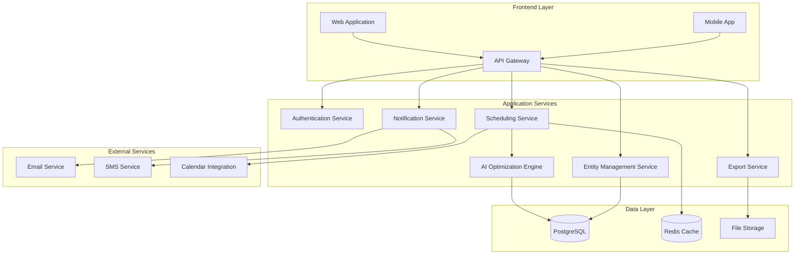

# AI Timetabler Design Document

## Overview

The AI Timetabler is built as a modern SaaS application using a microservices architecture with AI-powered optimization at its core. The system employs constraint satisfaction algorithms enhanced with machine learning to solve complex scheduling problems while providing an intuitive user experience. The architecture supports multi-tenancy, real-time collaboration, and scalable processing of large institutional timetabling requirements.

## Architecture

### High-Level Architecture



### Technology Stack

- **Frontend**: React.js with TypeScript, Material-UI for responsive design
- **Backend**: Node.js with Express.js, TypeScript for type safety
- **Database**: PostgreSQL for relational data, Redis for caching and real-time features
- **AI Engine**: Python with scikit-learn, OR-Tools for constraint optimization
- **Message Queue**: Redis Pub/Sub for real-time notifications
- **File Storage**: AWS S3 or compatible object storage
- **Authentication**: JWT with refresh tokens, OAuth2 integration

## Components and Interfaces

### Entity Management Service

**Purpose**: Manages all scheduling entities (venues, lecturers, courses, student groups)

**Key Components**:
- `VenueRepository`: CRUD operations for venue data with capacity and equipment tracking
- `LecturerRepository`: Manages lecturer profiles, availability, and preferences
- `CourseRepository`: Handles course definitions, requirements, and constraints
- `StudentGroupRepository`: Manages group compositions and enrollment data
- `ConstraintValidator`: Validates entity relationships and business rules

**API Endpoints**:
```typescript
interface EntityAPI {
  // Venue Management
  POST /api/venues
  GET /api/venues
  PUT /api/venues/:id
  DELETE /api/venues/:id
  
  // Lecturer Management
  POST /api/lecturers
  GET /api/lecturers
  PUT /api/lecturers/:id/availability
  GET /api/lecturers/:id/preferences
  
  // Course Management
  POST /api/courses
  GET /api/courses
  PUT /api/courses/:id
  
  // Student Group Management
  POST /api/student-groups
  GET /api/student-groups
}
```

### Scheduling Service

**Purpose**: Core timetabling logic, clash detection, and schedule management

**Key Components**:
- `TimetableEngine`: Orchestrates timetable generation and validation
- `ClashDetector`: Identifies scheduling conflicts across all dimensions
- `ScheduleRepository`: Persists and retrieves timetable data
- `ConflictResolver`: Interfaces with AI engine for conflict resolution
- `ScheduleValidator`: Ensures all constraints are satisfied

**Core Algorithms**:
```typescript
interface SchedulingAlgorithms {
  detectClashes(schedule: Schedule): Clash[]
  validateConstraints(schedule: Schedule): ValidationResult
  generateTimetable(constraints: Constraint[]): Schedule
  optimizeSchedule(schedule: Schedule): OptimizedSchedule
}
```

### AI Optimization Engine

**Purpose**: Provides intelligent timetable optimization and conflict resolution

**Key Components**:
- `ConstraintSolver`: Implements constraint satisfaction problem (CSP) solving
- `OptimizationEngine`: Uses genetic algorithms and simulated annealing
- `ConflictAnalyzer`: Analyzes clash patterns and suggests resolutions
- `PreferenceEngine`: Balances hard constraints with soft preferences
- `LearningModule`: Improves suggestions based on historical decisions

**Optimization Strategy**:
```python
class TimetableOptimizer:
    def solve_csp(self, constraints: List[Constraint]) -> Solution:
        # Use OR-Tools CP-SAT solver for hard constraints
        
    def optimize_preferences(self, solution: Solution) -> OptimizedSolution:
        # Apply genetic algorithm for soft constraint optimization
        
    def suggest_resolutions(self, clashes: List[Clash]) -> List[Resolution]:
        # Generate ranked resolution options
```

### Notification Service

**Purpose**: Real-time notifications and communication management

**Key Components**:
- `NotificationDispatcher`: Routes notifications to appropriate channels
- `TemplateEngine`: Generates personalized notification content
- `DeliveryTracker`: Monitors notification delivery and acknowledgments
- `PreferenceManager`: Manages user notification preferences
- `EscalationHandler`: Manages critical notification escalation

## Data Models

### Core Entities

```typescript
interface Venue {
  id: string
  name: string
  capacity: number
  equipment: Equipment[]
  availability: TimeSlot[]
  location: string
  accessibility: AccessibilityFeature[]
}

interface Lecturer {
  id: string
  name: string
  email: string
  department: string
  subjects: string[]
  availability: WeeklyAvailability
  preferences: LecturerPreferences
  maxHoursPerDay: number
  maxHoursPerWeek: number
}

interface Course {
  id: string
  name: string
  code: string
  duration: number // minutes
  frequency: Frequency
  requiredEquipment: Equipment[]
  studentGroups: string[]
  lecturerId: string
  constraints: CourseConstraint[]
}

interface StudentGroup {
  id: string
  name: string
  size: number
  courses: string[]
  yearLevel: number
  department: string
}

interface Schedule {
  id: string
  name: string
  academicPeriod: string
  timeSlots: ScheduledSession[]
  status: ScheduleStatus
  createdAt: Date
  lastModified: Date
}

interface ScheduledSession {
  id: string
  courseId: string
  lecturerId: string
  venueId: string
  studentGroups: string[]
  startTime: DateTime
  endTime: DateTime
  dayOfWeek: DayOfWeek
}
```

### Constraint Models

```typescript
interface Constraint {
  id: string
  type: ConstraintType
  priority: Priority
  entities: string[]
  rule: ConstraintRule
}

enum ConstraintType {
  HARD_AVAILABILITY = 'hard_availability',
  VENUE_CAPACITY = 'venue_capacity',
  EQUIPMENT_REQUIREMENT = 'equipment_requirement',
  LECTURER_PREFERENCE = 'lecturer_preference',
  STUDENT_BREAK = 'student_break',
  DEPARTMENT_POLICY = 'department_policy'
}

interface Clash {
  id: string
  type: ClashType
  severity: Severity
  affectedEntities: string[]
  description: string
  suggestedResolutions: Resolution[]
}
```

## Error Handling

### Error Categories

1. **Validation Errors**: Invalid input data, constraint violations
2. **Business Logic Errors**: Scheduling conflicts, capacity exceeded
3. **System Errors**: Database failures, external service unavailability
4. **AI Engine Errors**: Optimization failures, unsolvable constraints

### Error Response Strategy

```typescript
interface ErrorResponse {
  code: string
  message: string
  details?: any
  suggestions?: string[]
  timestamp: Date
}

class ErrorHandler {
  handleValidationError(error: ValidationError): ErrorResponse
  handleBusinessLogicError(error: BusinessError): ErrorResponse
  handleSystemError(error: SystemError): ErrorResponse
  handleOptimizationError(error: OptimizationError): ErrorResponse
}
```

### Recovery Mechanisms

- **Graceful Degradation**: Fall back to manual scheduling when AI optimization fails
- **Partial Solutions**: Provide best-effort timetables with highlighted conflicts
- **Rollback Capability**: Revert to previous working timetable versions
- **Alternative Suggestions**: Offer multiple resolution paths when primary optimization fails

## Testing Strategy

### Unit Testing
- **Entity Services**: Test CRUD operations, validation logic, constraint checking
- **AI Engine**: Test optimization algorithms with known problem sets
- **Clash Detection**: Verify conflict identification across all entity types
- **Notification System**: Test delivery mechanisms and preference handling

### Integration Testing
- **API Endpoints**: Test complete request/response cycles with realistic data
- **Database Operations**: Verify data consistency and transaction handling
- **External Services**: Mock and test email, SMS, calendar integrations
- **AI Pipeline**: Test end-to-end optimization workflow

### Performance Testing
- **Load Testing**: Simulate concurrent users generating timetables
- **Optimization Benchmarks**: Measure AI engine performance with large datasets
- **Database Performance**: Test query performance with realistic data volumes
- **Real-time Features**: Verify notification delivery under high load

### User Acceptance Testing
- **Workflow Testing**: Complete timetable creation and modification scenarios
- **Conflict Resolution**: Test AI suggestion quality and user acceptance
- **Multi-tenant Scenarios**: Verify data isolation and performance
- **Mobile Responsiveness**: Test across different devices and screen sizes

### Test Data Strategy
- **Synthetic Datasets**: Generate realistic institutional data for testing
- **Edge Cases**: Create scenarios with complex constraints and conflicts
- **Performance Datasets**: Large-scale data for load and performance testing
- **Regression Suites**: Maintain test cases for critical functionality