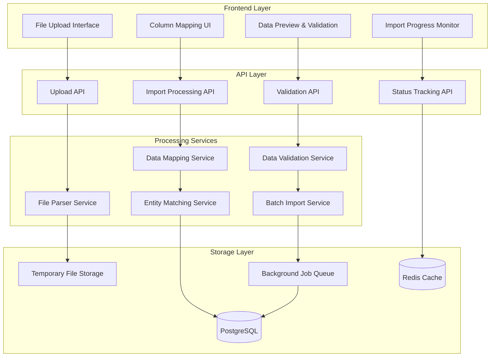

# Timetable Import Design Document

## Overview

The Timetable Import system is designed as a robust, scalable solution for bulk importing timetable data from CSV and Excel files. The system employs a multi-stage processing pipeline that handles file upload, parsing, data validation, entity matching, and batch import operations. The architecture emphasizes data integrity, user experience, and performance while providing comprehensive error handling and reporting capabilities.

## Architecture

### High-Level Architecture



### Technology Stack

- **File Processing**: xlsx library (already available), csv-parser for CSV handling
- **File Upload**: multer middleware for Express.js
- **Entity Matching**: fuse.js for fuzzy string matching
- **Background Processing**: Bull queue with Redis
- **Validation**: joi for schema validation
- **Progress Tracking**: Redis for real-time status updates
- **File Storage**: Local temporary storage with cleanup policies

## Components and Interfaces

### File Upload Service

**Purpose**: Handles file upload, validation, and temporary storage

**Key Components**:
- `FileUploadController`: Manages file upload endpoints and validation
- `FileValidator`: Validates file format, size, and basic structure
- `TemporaryStorage`: Manages temporary file storage and cleanup
- `FileMetadataExtractor`: Extracts basic file information and structure

**API Endpoints**:
```typescript
interface FileUploadAPI {
  POST /api/import/upload
  GET /api/import/templates/:format  // Download templates
  DELETE /api/import/files/:id       // Cleanup temporary files
}
```

**File Upload Flow**:
```typescript
interface FileUploadRequest {
  file: Express.Multer.File
  importType?: 'timetable' | 'entities'
}

interface FileUploadResponse {
  fileId: string
  originalName: string
  size: number
  detectedColumns: string[]
  rowCount: number
  previewData: any[][]
}
```

### File Parser Service

**Purpose**: Parses CSV and Excel files and extracts structured data

**Key Components**:
- `CSVParser`: Handles CSV file parsing with encoding detection
- `ExcelParser`: Processes Excel files (.xlsx, .xls) with multiple sheet support
- `DataNormalizer`: Standardizes data formats and handles common variations
- `ColumnDetector`: Analyzes column headers and suggests field mappings

**Parsing Strategy**:
```typescript
interface ParsedData {
  headers: string[]
  rows: Record<string, any>[]
  metadata: {
    totalRows: number
    emptyRows: number
    duplicateRows: number
    encoding?: string
    sheetName?: string
  }
}

class FileParserService {
  async parseCSV(filePath: string): Promise<ParsedData>
  async parseExcel(filePath: string, sheetIndex?: number): Promise<ParsedData>
  detectColumnMappings(headers: string[]): ColumnMapping[]
  normalizeData(rawData: any[][]): Record<string, any>[]
}
```

### Data Mapping Service

**Purpose**: Maps imported data columns to system entity fields

**Key Components**:
- `ColumnMapper`: Maps file columns to entity properties
- `MappingValidator`: Validates mapping completeness and correctness
- `MappingPersistence`: Saves and retrieves mapping configurations
- `DataTransformer`: Transforms mapped data to entity format

**Mapping Configuration**:
```typescript
interface ColumnMapping {
  sourceColumn: string
  targetField: string
  entityType: 'venue' | 'lecturer' | 'course' | 'studentGroup' | 'schedule'
  transformation?: TransformationType
  required: boolean
  defaultValue?: any
}

enum TransformationType {
  NONE = 'none',
  UPPERCASE = 'uppercase',
  LOWERCASE = 'lowercase',
  TRIM = 'trim',
  DATE_PARSE = 'date_parse',
  NUMBER_PARSE = 'number_parse',
  BOOLEAN_PARSE = 'boolean_parse',
  SPLIT_ARRAY = 'split_array'
}

interface MappingConfiguration {
  id: string
  name: string
  fileType: 'csv' | 'excel'
  mappings: ColumnMapping[]
  createdAt: Date
  lastUsed: Date
}
```

### Entity Matching Service

**Purpose**: Matches imported data with existing entities to prevent duplicates

**Key Components**:
- `VenueMatcher`: Matches venues by name and location
- `LecturerMatcher`: Matches lecturers by name and email
- `CourseMatcher`: Matches courses by code and name
- `StudentGroupMatcher`: Matches student groups by name and department
- `FuzzyMatcher`: Implements fuzzy string matching algorithms

**Matching Strategy**:
```typescript
interface MatchResult {
  entityId?: string
  confidence: number
  matchType: 'exact' | 'fuzzy' | 'none'
  suggestedMatches: SuggestedMatch[]
}

interface SuggestedMatch {
  entityId: string
  entity: any
  confidence: number
  matchingFields: string[]
}

class EntityMatchingService {
  async matchVenue(venueData: Partial<Venue>): Promise<MatchResult>
  async matchLecturer(lecturerData: Partial<Lecturer>): Promise<MatchResult>
  async matchCourse(courseData: Partial<Course>): Promise<MatchResult>
  async matchStudentGroup(groupData: Partial<StudentGroup>): Promise<MatchResult>
  
  private fuzzyMatch(searchText: string, candidates: string[]): MatchResult[]
}
```

### Data Validation Service

**Purpose**: Validates imported data against business rules and constraints

**Key Components**:
- `EntityValidator`: Validates individual entity data
- `RelationshipValidator`: Validates entity relationships and references
- `ConstraintValidator`: Checks business rule compliance
- `ConflictDetector`: Identifies scheduling conflicts in imported data

**Validation Pipeline**:
```typescript
interface ValidationResult {
  isValid: boolean
  errors: ValidationError[]
  warnings: ValidationWarning[]
  entityCounts: {
    venues: { new: number; existing: number }
    lecturers: { new: number; existing: number }
    courses: { new: number; existing: number }
    studentGroups: { new: number; existing: number }
    schedules: { new: number; conflicts: number }
  }
}

interface ValidationError {
  row: number
  field: string
  message: string
  severity: 'error' | 'warning'
  suggestedFix?: string
}

class DataValidationService {
  async validateImportData(
    mappedData: MappedImportData,
    matchResults: EntityMatchResults
  ): Promise<ValidationResult>
  
  private validateEntityData(entityType: string, data: any): ValidationError[]
  private validateScheduleConflicts(schedules: ScheduledSession[]): ValidationError[]
  private validateCapacityConstraints(sessions: ScheduledSession[]): ValidationError[]
}
```

### Batch Import Service

**Purpose**: Executes the actual import process with progress tracking

**Key Components**:
- `ImportOrchestrator`: Coordinates the entire import process
- `EntityCreator`: Creates new entities in the database
- `EntityUpdater`: Updates existing entities with imported data
- `ProgressTracker`: Tracks and reports import progress
- `ErrorReporter`: Generates detailed import reports

**Import Process**:
```typescript
interface ImportJob {
  id: string
  userId: string
  fileId: string
  mappingConfig: MappingConfiguration
  validationResult: ValidationResult
  status: ImportStatus
  progress: ImportProgress
  createdAt: Date
  completedAt?: Date
}

enum ImportStatus {
  PENDING = 'pending',
  PROCESSING = 'processing',
  COMPLETED = 'completed',
  FAILED = 'failed',
  CANCELLED = 'cancelled'
}

interface ImportProgress {
  totalRows: number
  processedRows: number
  successfulRows: number
  failedRows: number
  currentStage: ImportStage
  estimatedTimeRemaining?: number
}

enum ImportStage {
  PARSING = 'parsing',
  MAPPING = 'mapping',
  VALIDATION = 'validation',
  ENTITY_CREATION = 'entity_creation',
  SCHEDULE_IMPORT = 'schedule_import',
  FINALIZATION = 'finalization'
}
```

## Data Models

### Import-Specific Models

```typescript
interface ImportSession {
  id: string
  userId: string
  fileName: string
  fileSize: number
  fileType: 'csv' | 'excel'
  status: ImportSessionStatus
  mappingConfigId?: string
  validationResults?: ValidationResult
  importJobId?: string
  createdAt: Date
  expiresAt: Date
}

enum ImportSessionStatus {
  UPLOADED = 'uploaded',
  MAPPED = 'mapped',
  VALIDATED = 'validated',
  IMPORTING = 'importing',
  COMPLETED = 'completed',
  FAILED = 'failed'
}

interface MappedImportData {
  venues: Partial<Venue>[]
  lecturers: Partial<Lecturer>[]
  courses: Partial<Course>[]
  studentGroups: Partial<StudentGroup>[]
  schedules: Partial<ScheduledSession>[]
  metadata: {
    sourceFile: string
    mappingConfig: string
    importedAt: Date
    importedBy: string
  }
}

interface EntityMatchResults {
  venues: Map<number, MatchResult>      // row index -> match result
  lecturers: Map<number, MatchResult>
  courses: Map<number, MatchResult>
  studentGroups: Map<number, MatchResult>
}
```

### Template Models

```typescript
interface ImportTemplate {
  id: string
  name: string
  description: string
  fileType: 'csv' | 'excel'
  columns: TemplateColumn[]
  sampleData: Record<string, any>[]
  version: string
  createdAt: Date
}

interface TemplateColumn {
  name: string
  description: string
  required: boolean
  dataType: 'string' | 'number' | 'date' | 'boolean' | 'array'
  format?: string
  examples: string[]
  validation?: {
    minLength?: number
    maxLength?: number
    pattern?: string
    allowedValues?: string[]
  }
}
```

## Error Handling

### Error Categories

1. **File Upload Errors**: Invalid format, size limits, corrupted files
2. **Parsing Errors**: Malformed data, encoding issues, structural problems
3. **Mapping Errors**: Missing required fields, invalid mappings
4. **Validation Errors**: Business rule violations, constraint conflicts
5. **Import Errors**: Database failures, transaction rollbacks

### Error Recovery Strategies

```typescript
interface ErrorRecoveryStrategy {
  skipInvalidRows: boolean
  createMissingEntities: boolean
  resolveConflictsAutomatically: boolean
  rollbackOnError: boolean
  maxErrorThreshold: number
}

class ImportErrorHandler {
  handleFileUploadError(error: FileUploadError): ErrorResponse
  handleParsingError(error: ParsingError): ErrorResponse
  handleValidationError(error: ValidationError): ErrorResponse
  handleImportError(error: ImportError): ErrorResponse
  
  generateErrorReport(errors: ImportError[]): ImportErrorReport
  suggestErrorResolutions(errors: ImportError[]): ErrorResolution[]
}
```

## Testing Strategy

### Unit Testing
- **File Parsers**: Test CSV and Excel parsing with various formats and edge cases
- **Entity Matching**: Test fuzzy matching algorithms with different similarity thresholds
- **Data Validation**: Test business rule validation with valid and invalid data sets
- **Mapping Logic**: Test column mapping and data transformation functions

### Integration Testing
- **End-to-End Import**: Test complete import workflow with sample files
- **Error Scenarios**: Test error handling and recovery mechanisms
- **Performance Testing**: Test import performance with large files (1000+ rows)
- **Concurrent Imports**: Test multiple simultaneous import operations

### Test Data Strategy
- **Sample Files**: Create CSV and Excel files with various data scenarios
- **Edge Cases**: Test files with missing data, special characters, different encodings
- **Large Datasets**: Generate files with thousands of rows for performance testing
- **Error Scenarios**: Create files with intentional errors for error handling tests

### Performance Benchmarks
- **File Upload**: < 5 seconds for files up to 10MB
- **Parsing**: < 30 seconds for files with 10,000 rows
- **Entity Matching**: < 2 seconds per 1,000 entities
- **Import Processing**: < 5 minutes for 5,000 schedule entries
- **Memory Usage**: < 500MB for processing large files

## Security Considerations

### File Upload Security
- **File Type Validation**: Strict validation of file extensions and MIME types
- **Virus Scanning**: Integration with antivirus scanning for uploaded files
- **Size Limits**: Enforce maximum file size limits to prevent DoS attacks
- **Temporary Storage**: Secure temporary file storage with automatic cleanup

### Data Privacy
- **Access Control**: Role-based access to import functionality
- **Data Encryption**: Encrypt temporary files and sensitive data in transit
- **Audit Logging**: Log all import activities for compliance and security
- **Data Retention**: Automatic cleanup of temporary files and import data

### Input Validation
- **SQL Injection Prevention**: Parameterized queries for all database operations
- **XSS Prevention**: Sanitize all user input and file content
- **Data Validation**: Strict validation of all imported data against schemas
- **Rate Limiting**: Limit import frequency to prevent abuse